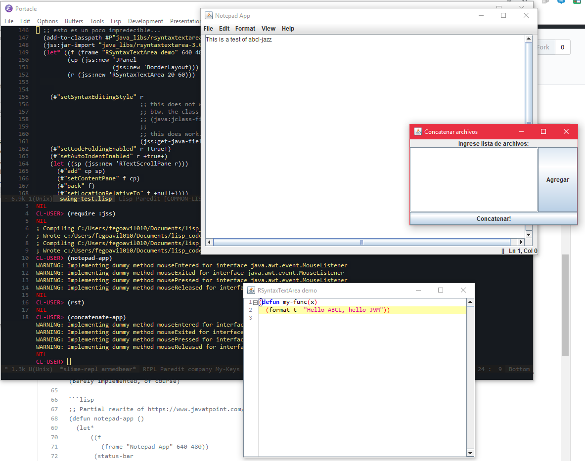

# abcl-jazz

A simple example on how to use Swing UI components from Common Lisp (using ABCL)

This, hopefully, sometime, will become a full featured UI library. Or not.

## Screenshot

 

## Prior Art

Snow: Nice, but too verbose, and too detached from the swing classes.

## Reason

Why?

Because desktop "native" apps never died. And using Electron is immoral.

Instead of Electron, let's use:

 - as platform: the JVM, which is usually already present
 - as language, the right tool for the job: The job is programming, and the tool
   is Common Lisp
 - Common Lisp + JVM = Armed Bear Common Lisp, which shall be the implementation
 - This also means leveraging the HUGE ecosystem of Java libs is easy as piece of cake.

Note: Not only is swing programming under JAZZ easier than Java, it is also 
      easier, for example, than under Jython (Python for the JVM)

## Usage

Requires ABCL. So, load ABCL. I used ABCL 1.5.0

`(require)` :abcl-contrib, and :jss

Useful to do `(setf jss:*muffle-warnings* nil)` as well.

Then load `swing.lisp` and try the examples in `swing-test.lisp`. This creates no packages.

## Example(s)

See `swing-test.lisp`

This includes three examples:

- `(concatenate-app)` : Simple UI example using the BorderLayout. 
- `(rst)`: Use of an external UI lib, [RSyntaxTextArea](http://bobbylight.github.io/RSyntaxTextArea/), to open a window that works as a Lisp code editor with syntax highlighting. 
- Notepad wannabe-app (see below)

Pasted from there: A "notepad"-like application where you just edit text and the window shows cursor position. Includes menu bars. (Barely implemented, of course)

```lisp
;; Partial rewrite of https://www.javatpoint.com/notepad
(defun notepad-app ()
  (let*
      ((f
         (frame "Notepad App" 640 480))
       (status-bar
         (label "||       Ln 1, Col 1  " +align-right+))
       (ta                              ;textarea
         (textarea "" 30 60))
       (not-implemented
         (lambda (e)
           (declare (ignore e))
           (show-warning-message f "Not Implemented"))))
    ;; Here we go...
    (add-using-borderlayout f
                            :center (scrollpane ta)
                            :south status-bar
                            :east (label "   ")
                            :west (label "   "))
    (pack f)
                                        

    ;; menu bar
    (set-menu-bar f 
                  (list 
                   (menu "File" 
                         (list 
                          (menuitem "New" not-implemented)
                          (menuitem "Open" not-implemented)
                          (menuitem "Save" not-implemented)
                          (menuitem "Save as..." not-implemented)))
                   (menu "Edit" 
                         (list 
                          (menuitem "Undo!" not-implemented)
                          (separator)
                          (menuitem "Cut" not-implemented)
                          (menuitem "Copy" not-implemented)
                          (menuitem "Paste" not-implemented)
                          (menuitem "Delete" not-implemented)
                          (separator)
                          (menuitem "Select all" not-implemented)
                          ))
                   (menu "Format" ())
                   (menu "View" ())
                   (menu "Help" ())))

    ;; right-click popup menu
    (add-popupmenu-to-container
     ta                                 ;to text area 
     (popupmenu "Right click menu" 
                (list
                 (menuitem "Undo!" not-implemented)
                 (separator)
                 (menuitem "Cut")
                 (menuitem "Copy")
                 (menuitem "Paste"))))

    ;; caretlistener for text area
    (add-caretlistener ta
                       (lambda (e)
                         (declare (ignore e))
                         (let* ((pos (#"getCaretPosition" ta))
                                (line (#"getLineOfOffset" ta pos))
                                (col (- pos (#"getLineStartOffset" ta line))))
                           (#"setText" status-bar
                                       (format nil "||   Ln ~D, Col ~D"
                                               line
                                               col)))))
    (set-visible f)))

``` 

The `concatenate-app` example shows how easy is using the BorderLayout from Lisp, compared to doing it from Java.
See the `add-using-border-layout` function below.

```lisp
(defun concatenate-app ()
  (handler-case 
      (let* ((f (frame "Concatenar archivos"))
             (list-model (defaultlistmodel))
             (l (jlist list-model)))

        ;; popup menu for list
        (add-popupmenu-to-container
         l
         (popupmenu "Menu" 
                    (list
                     (menuitem "Eliminar item"
                               (lambda (e)
                                 (declare (ignore e))
                                 (let ((confirm
                                         (show-confirm-dialog f "Está seguro?")))
                                   (when (eql +dialog-yes+
                                              confirm)
                                     ;; remove item from list...
                                     ;; at index...
                                     (let ((selected-i
                                             (#"getSelectedIndex" l)))
                                       (#"remove" list-model selected-i)))))))))
        (add-using-borderlayout
         f
         :center (scrollpane l)             ;list inside scrollpane
         :north (label "Ingrese lista de archivos:" +align-center+)
         :east (button "Agregar" 
                       (lambda (e)
                         (declare (ignore e))
                         ;; add (choose) file
                         (let* ((chooser (file-chooser))
                                file)
                           ;; add extensions to chooser
                           (file-chooser-add-extension chooser "Archivo CSV" '("csv"))
                           (file-chooser-add-extension chooser "Archivo de texto" '("txt" "text"))
                           ;; open file chooser
                           (setf file
                                 (open-file-chooser chooser f))
                           ;;add file to list
                           (when file
                             (defaultlistmodel-add list-model file)))))
         :south (button "Concatenar!"
                        (lambda (e)
                          (declare (ignore e))
                          (show-warning-message f "Not Implemented!"))))
        (pack f))
    (java:java-exception (x)
      (format t "JavaException: ~A ~%" x))
    (error (x)
      (format t "Error: ~A ~%" x))))

```

This one is in spanish, because *I speak very... very fluent spanish. Todo está bien chévere. Bien chévere.* (Stevie Wonder, "Don't you worry about a thing"). 

Stevie Wonder, needless to say, is a funky drummer too.

## Philosophy

If this example evolves into a lib, this would be my preferred philosophy:

- should be very easy to learn
- it is to be designed with the aim of producing easy to write, easy to read
  GUI code.
 --- note: commands that instantiate swing  UI controls have no hypens

 - shouldn't require to learn a whole new DSL or lib. Existing java swing tutorials
    should tell you 80% of what you need to know.
 --- things that are named 'x' on swing tutorials shall be named 'x' here.
     we're not inventing new slang.
 - the source code of this lib is to be easy to understand as well
 - typically-used stuff should be non-verbose
 - typical controls (label, textbox, etc) should be easy to instantiate
 - action listeners should be damn easy to instantiate
 - typical configuration parameters of each control (i.e. text box column width)
   should be already present on instantiation; the other seldom-used
   parameters should be configured by calling the appropiate methods.
   in other words, use Jazz syntax to quickly create the UI,
   and call the appropiate java methods for config options that are not
   often used.


## Author

Defunkydrummer

## License

MIT
